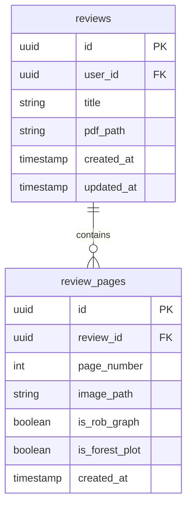

# Database Overview

## Schema Structure

SmartGRADE uses a simple, efficient schema with two main tables:



## Key Concepts

### Reviews Table

- Core entity representing a systematic review document
- Each review belongs to a single user
- Can have an associated PDF document

### Review Pages Table

- Individual pages extracted from review PDFs
- Each page can be classified as ROB graph or forest plot
- Page numbers must be unique within a review

## Relationships

- **One-to-Many**: One review has many pages
- **Cascade Delete**: Deleting a review automatically deletes all its pages
- **User Scoping**: All data is scoped to the authenticated user

## Automatic Features

### Timestamps

- `created_at`: Set automatically on insert
- `updated_at`: Updated automatically on any change (reviews table only)

### Constraints

- Review titles: 1-500 characters
- Page numbers: Must be positive integers
- Unique constraint: (review_id, page_number) combination

## Storage Integration

Files are organized in Supabase Storage:

```
reviews/
├── {review_id}/
│   ├── document.pdf
│   └── pages/
│       ├── page_1.png
│       ├── page_2.png
│       └── ...
```

## Next Steps

- [Table Details](02_tables.md) - Detailed table specifications
